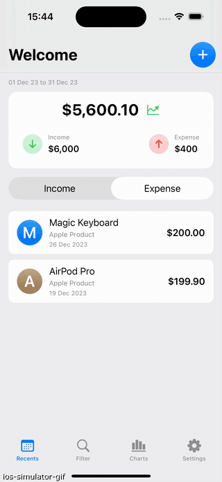
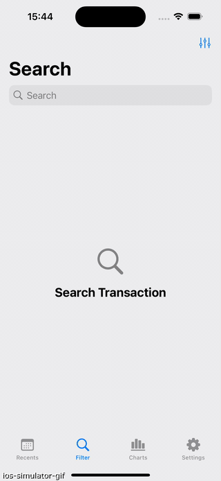
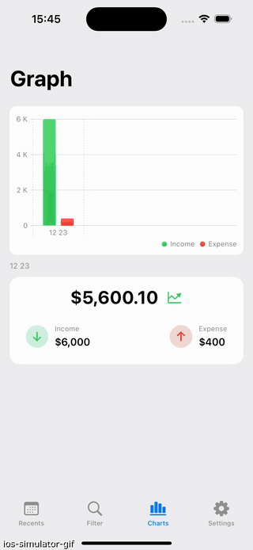
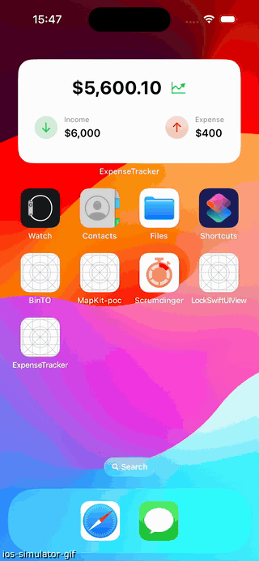

# Kavsoft SwiftUI Tutorial 

## Introduction
This repository contains materials for learning SwiftUI through tutorials provided by [kavsoft](https://kavsoft.dev/). It is solely for learning purposes. All rights and copyrights are owned by Kavsoft. I do not own the material.

Welcome to join his [Patreon](https://www.patreon.com/kavsoft) to support his work. ❤️

## Projects

### Expense Tracker

[Expense Tracker | SwiftData | Widgets | AppLock | iOS 17](https://www.youtube.com/playlist?list=PLimqJDzPI-H88PbxlOtNPkD0n0n-q-__z) || [ExpenseTracker](./ExpenseTracker/)

    
    
    
    

 
