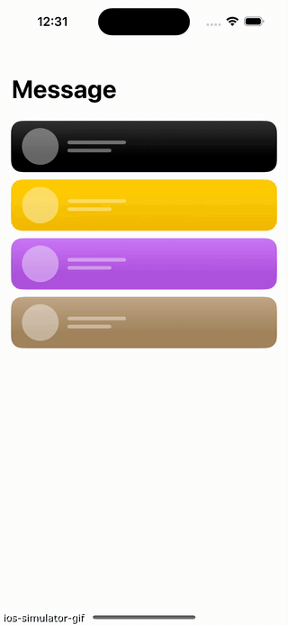
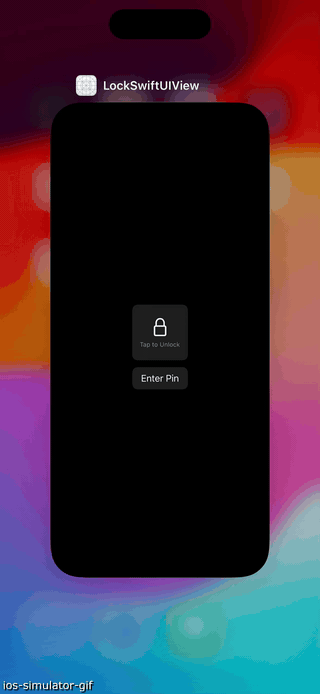

## Projects

 - [Swipe Actions For ScrollView - No Gestures! - iOS 17 Scroll APIs - Xcode 15](https://www.youtube.com/watch?v=K8VnH2eEnK4&ab_channel=Kavsoft) || [CustomSwipeAction](./CustomSwipeAction)

 - [Lock SwiftUI View With Biometric/Custom Number Lock - Local Authentication - iOS 17 - Xcode 15
](https://www.youtube.com/watch?v=K8VnH2eEnK4&ab_channel=Kavsoft) || [CustomSwipeAction](./LockSwiftUIView/)

    
    

 
